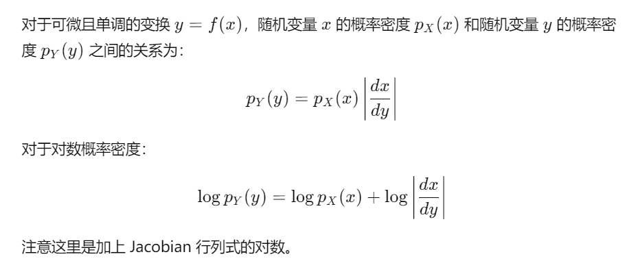
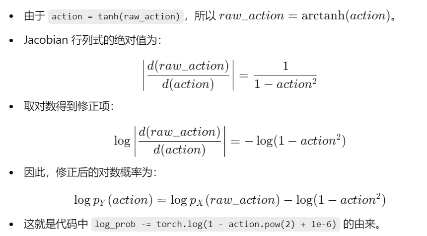

**为什么需要修正？**

- 当对随机变量进行非线性变换时，其概率密度函数会发生改变。

- 在本例中，我们对 `raw_action` 应用了 `tanh` 变换，得到 `action = tanh(raw_action)`。

- 因此，需要使用**变化后的随机变量的概率密度**，这涉及到概率密度函数的变换公式。

  

**概率密度的变换公式**：

**但在代码中为什么是减去修正项？**

**代码中的 `1e-6`**

- 添加一个小的数值 `1e-6`，是为了防止数值不稳定和除零错误，避免 `action` 接近 ±1\pm1±1 时导致 `log(0)`。